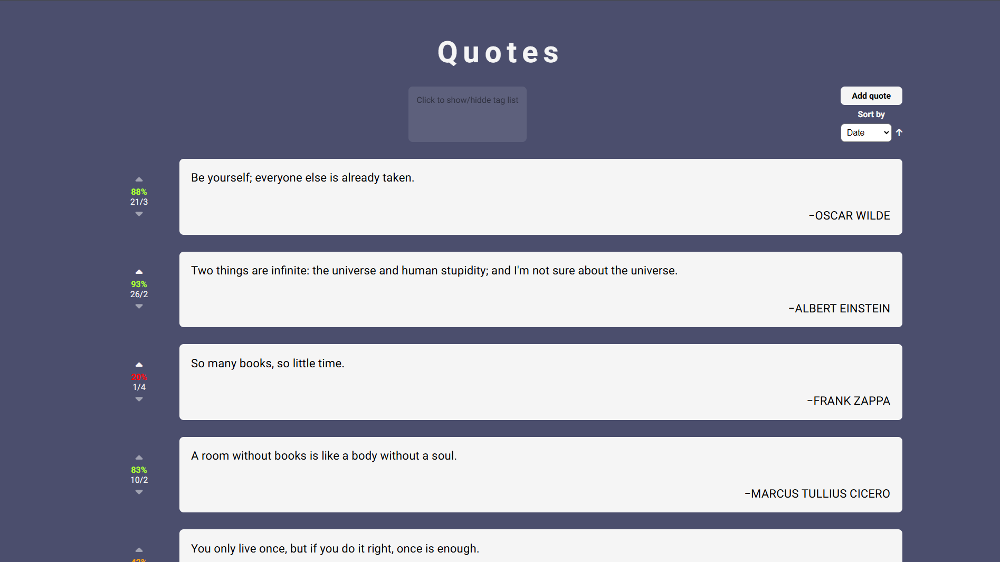
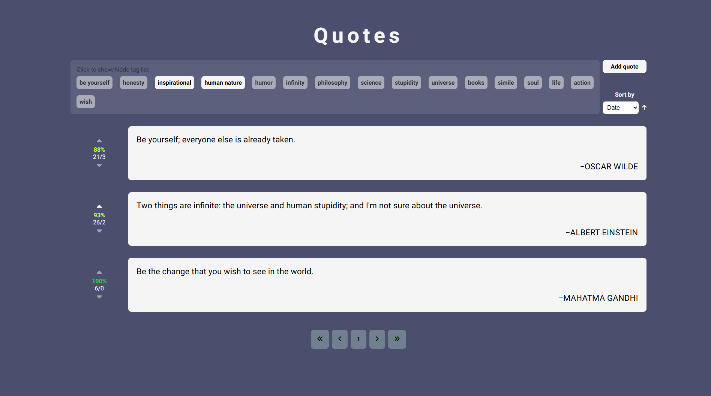

# Quotes App

📜 **Quotes App**

A web application that allows users to browse, filter, and manage a collection of quotes. The app provides an easy-to-use interface to interact with quotes, vote on them, and organize them by various criteria. Built with React.

## 📋 Table of Contents

- [✨ Features](#features-)
- [🛠️ Installation](#installation-)
- [🚀 Usage](#usage-)
- [💻 Technologies](#technologies-)
- [📷 Screenshots](#screenshots-)
- [🌐 Live Demo](#live-demo-)
- [🤝 Contributing](#contributing-)

## Features ✨

- Browse quotes with pagination
- Filter quotes by tags
- Sort quotes by author, date, or upvotes
- Add new quotes with tags
- Vote on quotes (upvote/downvote)

## Installation

1. Clone the repository:
   ```bash
   git clone https://github.com/your-username/quotes-app.git
   ```
2. Navigate to the project directory:
   ```bash
   cd quotes-app
   ```
3. Install dependencies:
   ```bash
   npm install
   ```

## Usage 🚀

1. Start the development server:
   ```bash
   npm run dev
   ```
2. Open your browser and navigate to `http://localhost:5173`.

## Technologies 💻

### Frontend

- React
- CSS

### Backend

- Node.js
- Express

## Screenshots 📷




## Live Demo 🌐

Check out the live version of the game here: [Quotes App](https://quotes-vukasin.netlify.app/)

## Contributing 🤝

Contributions are welcome! Please follow these steps:

1. Fork the repository.
2. Create a new branch:
   ```bash
   git checkout -b feature-name
   ```
3. Commit your changes:
   ```bash
   git commit -m "Add feature-name"
   ```
4. Push to the branch:
   ```bash
   git push origin feature-name
   ```
5. Create a pull request.
